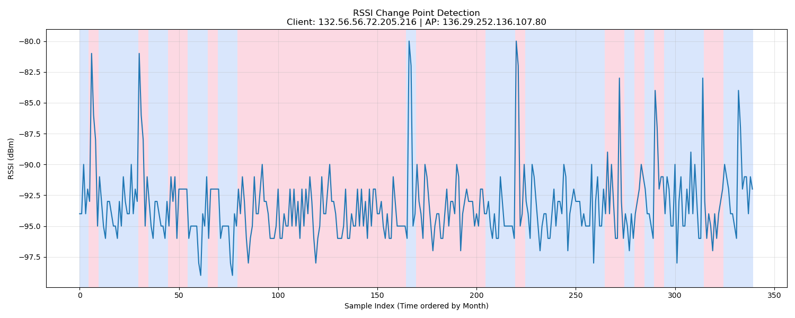

# Change Point Analysis Report

## Trace Info
- **Client**: `132.56.56.72.205.216`
- **AP**: `136.29.252.136.107.80`
- **Total Samples**: 340
- **Months**: 02, 03, 04, 05, 06, 07, 08, 09, 10, 11

## Detection Results
- **Algorithm**: Pelt
- **Model**: l2 (Least Squared Error)
- **Penalty**: 10
- **Detected Change Points**: 22

### Segment Statistics
| Segment | Index Range | Samples | Mean RSSI (dBm) | Std Dev |
| :--- | :--- | :--- | :--- | :--- |
| 1 | 0 to 4 | 5 | -92.80 | 1.60 |
| 2 | 5 to 9 | 5 | -88.60 | 5.00 |
| 3 | 10 to 29 | 20 | -93.50 | 1.60 |
| 4 | 30 to 34 | 5 | -88.20 | 4.71 |
| 5 | 35 to 44 | 10 | -94.30 | 1.19 |
| 6 | 45 to 54 | 10 | -92.60 | 1.56 |
| 7 | 55 to 64 | 10 | -95.30 | 2.05 |
| 8 | 65 to 69 | 5 | -92.80 | 1.60 |
| 9 | 70 to 79 | 10 | -95.40 | 1.85 |
| 10 | 80 to 164 | 85 | -94.06 | 1.78 |
| 11 | 165 to 169 | 5 | -89.40 | 6.92 |
| 12 | 170 to 204 | 35 | -93.51 | 1.83 |
| 13 | 205 to 219 | 15 | -94.60 | 1.36 |
| 14 | 220 to 224 | 5 | -88.20 | 6.14 |
| 15 | 225 to 264 | 40 | -93.72 | 1.92 |
| 16 | 265 to 274 | 10 | -92.40 | 3.88 |
| 17 | 275 to 279 | 5 | -95.20 | 1.17 |
| 18 | 280 to 284 | 5 | -92.00 | 1.41 |
| 19 | 285 to 289 | 5 | -94.20 | 1.33 |
| 20 | 290 to 294 | 5 | -89.00 | 3.03 |
| 21 | 295 to 314 | 20 | -92.80 | 3.20 |
| 22 | 315 to 324 | 10 | -94.40 | 1.50 |
| 23 | 325 to 339 | 15 | -91.60 | 2.96 |

## Conclusion
The analysis detected **22** points where the statistical properties (mean) of the RSSI signal changed significantly.
The signal shows distinct shifts in mean RSSI, suggesting environmental changes or mobility behavior.

## Visualization

