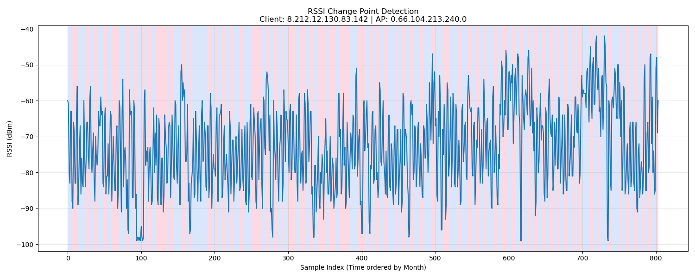

# Change Point Analysis Report

## Trace Info
- **Client**: `8.212.12.130.83.142`
- **AP**: `0.66.104.213.240.0`
- **Total Samples**: 804
- **Months**: 02, 03, 04, 05, 06, 07, 08, 09, 10, 11

## Detection Results
- **Algorithm**: Pelt
- **Model**: l2 (Least Squared Error)
- **Penalty**: 10
- **Detected Change Points**: 125

### Segment Statistics
| Segment | Index Range | Samples | Mean RSSI (dBm) | Std Dev |
| :--- | :--- | :--- | :--- | :--- |
| 1 | 0 to 4 | 5 | -69.40 | 9.97 |
| 2 | 5 to 14 | 10 | -75.00 | 12.18 |
| 3 | 15 to 24 | 10 | -77.00 | 8.16 |
| 4 | 25 to 29 | 5 | -72.60 | 5.54 |
| 5 | 30 to 34 | 5 | -69.20 | 9.43 |
| 6 | 35 to 39 | 5 | -77.00 | 7.21 |
| 7 | 40 to 49 | 10 | -70.30 | 8.52 |
| 8 | 50 to 54 | 5 | -75.20 | 9.41 |
| 9 | 55 to 59 | 5 | -72.40 | 8.55 |
| 10 | 60 to 69 | 10 | -79.50 | 7.77 |
| 11 | 70 to 79 | 10 | -71.70 | 11.06 |
| 12 | 80 to 84 | 5 | -84.40 | 14.71 |
| 13 | 85 to 89 | 5 | -72.80 | 11.60 |
| 14 | 90 to 94 | 5 | -79.60 | 15.40 |
| 15 | 95 to 99 | 5 | -98.40 | 0.49 |
| 16 | 100 to 104 | 5 | -90.20 | 14.66 |
| 17 | 105 to 109 | 5 | -71.80 | 7.63 |
| 18 | 110 to 114 | 5 | -81.00 | 6.42 |
| 19 | 115 to 119 | 5 | -74.60 | 8.94 |
| 20 | 120 to 134 | 15 | -77.47 | 9.57 |
| 21 | 135 to 139 | 5 | -73.00 | 7.40 |
| 22 | 140 to 144 | 5 | -76.40 | 7.86 |
| 23 | 145 to 154 | 10 | -73.30 | 12.28 |
| 24 | 155 to 159 | 5 | -56.20 | 3.54 |
| 25 | 160 to 164 | 5 | -75.60 | 8.62 |
| 26 | 165 to 169 | 5 | -88.00 | 6.99 |
| 27 | 170 to 189 | 20 | -75.45 | 9.12 |
| 28 | 190 to 194 | 5 | -72.40 | 10.87 |
| 29 | 195 to 199 | 5 | -77.40 | 9.13 |
| 30 | 200 to 204 | 5 | -75.20 | 9.70 |
| 31 | 205 to 209 | 5 | -68.00 | 10.06 |
| 32 | 210 to 214 | 5 | -78.60 | 7.76 |
| 33 | 215 to 219 | 5 | -81.80 | 5.42 |
| 34 | 220 to 224 | 5 | -73.00 | 8.17 |
| 35 | 225 to 234 | 10 | -76.80 | 6.90 |
| 36 | 235 to 239 | 5 | -79.00 | 6.16 |
| 37 | 240 to 249 | 10 | -76.30 | 10.61 |
| 38 | 250 to 264 | 15 | -73.80 | 9.33 |
| 39 | 265 to 269 | 5 | -71.40 | 11.36 |
| 40 | 270 to 274 | 5 | -58.40 | 8.04 |
| 41 | 275 to 279 | 5 | -87.80 | 12.27 |
| 42 | 280 to 284 | 5 | -70.40 | 8.01 |
| 43 | 285 to 289 | 5 | -76.40 | 7.23 |
| 44 | 290 to 294 | 5 | -71.40 | 11.94 |
| 45 | 295 to 299 | 5 | -67.20 | 5.00 |
| 46 | 300 to 309 | 10 | -72.00 | 8.11 |
| 47 | 310 to 314 | 5 | -75.00 | 10.99 |
| 48 | 315 to 324 | 10 | -72.90 | 9.81 |
| 49 | 325 to 329 | 5 | -69.60 | 9.20 |
| 50 | 330 to 334 | 5 | -78.80 | 13.76 |
| 51 | 335 to 339 | 5 | -86.00 | 7.72 |
| 52 | 340 to 349 | 10 | -81.50 | 6.59 |
| 53 | 350 to 354 | 5 | -75.40 | 7.14 |
| 54 | 355 to 364 | 10 | -82.20 | 5.88 |
| 55 | 365 to 369 | 5 | -72.80 | 12.64 |
| 56 | 370 to 384 | 15 | -76.47 | 9.10 |
| 57 | 385 to 394 | 10 | -69.10 | 10.27 |
| 58 | 395 to 404 | 10 | -78.20 | 12.94 |
| 59 | 405 to 409 | 5 | -68.00 | 5.10 |
| 60 | 410 to 414 | 5 | -82.40 | 11.98 |
| 61 | 415 to 419 | 5 | -72.60 | 8.26 |
| 62 | 420 to 424 | 5 | -77.60 | 11.53 |
| 63 | 425 to 429 | 5 | -68.00 | 8.56 |
| 64 | 430 to 434 | 5 | -80.60 | 4.80 |
| 65 | 435 to 444 | 10 | -78.10 | 8.37 |
| 66 | 445 to 449 | 5 | -74.20 | 8.11 |
| 67 | 450 to 454 | 5 | -81.20 | 8.35 |
| 68 | 455 to 459 | 5 | -70.20 | 11.46 |
| 69 | 460 to 464 | 5 | -81.20 | 10.57 |
| 70 | 465 to 469 | 5 | -68.60 | 14.26 |
| 71 | 470 to 479 | 10 | -75.70 | 7.13 |
| 72 | 480 to 484 | 5 | -77.80 | 7.78 |
| 73 | 485 to 494 | 10 | -69.20 | 7.44 |
| 74 | 495 to 499 | 5 | -57.20 | 8.52 |
| 75 | 500 to 509 | 10 | -74.70 | 14.60 |
| 76 | 510 to 519 | 10 | -72.30 | 12.24 |
| 77 | 520 to 529 | 10 | -70.00 | 10.30 |
| 78 | 530 to 534 | 5 | -80.00 | 6.23 |
| 79 | 535 to 544 | 10 | -71.70 | 9.38 |
| 80 | 545 to 549 | 5 | -59.60 | 3.72 |
| 81 | 550 to 554 | 5 | -76.40 | 8.75 |
| 82 | 555 to 559 | 5 | -69.80 | 7.19 |
| 83 | 560 to 564 | 5 | -76.40 | 6.34 |
| 84 | 565 to 569 | 5 | -68.80 | 9.28 |
| 85 | 570 to 579 | 10 | -72.30 | 10.99 |
| 86 | 580 to 584 | 5 | -77.40 | 6.53 |
| 87 | 585 to 589 | 5 | -73.60 | 10.19 |
| 88 | 590 to 599 | 10 | -59.30 | 9.07 |
| 89 | 600 to 604 | 5 | -54.40 | 3.01 |
| 90 | 605 to 609 | 5 | -58.20 | 8.49 |
| 91 | 610 to 614 | 5 | -55.40 | 7.42 |
| 92 | 615 to 619 | 5 | -75.40 | 19.77 |
| 93 | 620 to 624 | 5 | -61.60 | 4.18 |
| 94 | 625 to 629 | 5 | -56.60 | 8.38 |
| 95 | 630 to 634 | 5 | -63.80 | 7.88 |
| 96 | 635 to 639 | 5 | -74.80 | 12.56 |
| 97 | 640 to 644 | 5 | -70.20 | 7.98 |
| 98 | 645 to 649 | 5 | -75.40 | 9.52 |
| 99 | 650 to 654 | 5 | -70.60 | 11.22 |
| 100 | 655 to 659 | 5 | -64.40 | 5.68 |
| 101 | 660 to 664 | 5 | -75.60 | 7.39 |
| 102 | 665 to 669 | 5 | -68.60 | 8.71 |
| 103 | 670 to 674 | 5 | -76.40 | 7.86 |
| 104 | 675 to 679 | 5 | -78.80 | 7.83 |
| 105 | 680 to 684 | 5 | -71.00 | 8.17 |
| 106 | 685 to 689 | 5 | -73.80 | 6.55 |
| 107 | 690 to 694 | 5 | -63.20 | 4.40 |
| 108 | 695 to 699 | 5 | -69.20 | 11.07 |
| 109 | 700 to 709 | 10 | -57.80 | 4.09 |
| 110 | 710 to 714 | 5 | -53.80 | 6.97 |
| 111 | 715 to 719 | 5 | -51.40 | 8.06 |
| 112 | 720 to 724 | 5 | -57.20 | 4.75 |
| 113 | 725 to 734 | 10 | -60.00 | 15.11 |
| 114 | 735 to 739 | 5 | -77.80 | 14.52 |
| 115 | 740 to 749 | 10 | -57.00 | 5.27 |
| 116 | 750 to 754 | 5 | -67.00 | 10.30 |
| 117 | 755 to 759 | 5 | -72.20 | 13.09 |
| 118 | 760 to 764 | 5 | -77.20 | 6.24 |
| 119 | 765 to 769 | 5 | -72.80 | 8.35 |
| 120 | 770 to 774 | 5 | -78.80 | 9.20 |
| 121 | 775 to 779 | 5 | -81.40 | 7.34 |
| 122 | 780 to 784 | 5 | -75.60 | 11.22 |
| 123 | 785 to 789 | 5 | -71.00 | 13.13 |
| 124 | 790 to 794 | 5 | -65.00 | 14.53 |
| 125 | 795 to 799 | 5 | -76.80 | 9.87 |
| 126 | 800 to 803 | 4 | -57.00 | 8.22 |

## Conclusion
The analysis detected **125** points where the statistical properties (mean) of the RSSI signal changed significantly.
The signal shows distinct shifts in mean RSSI, suggesting environmental changes or mobility behavior.

## Visualization

