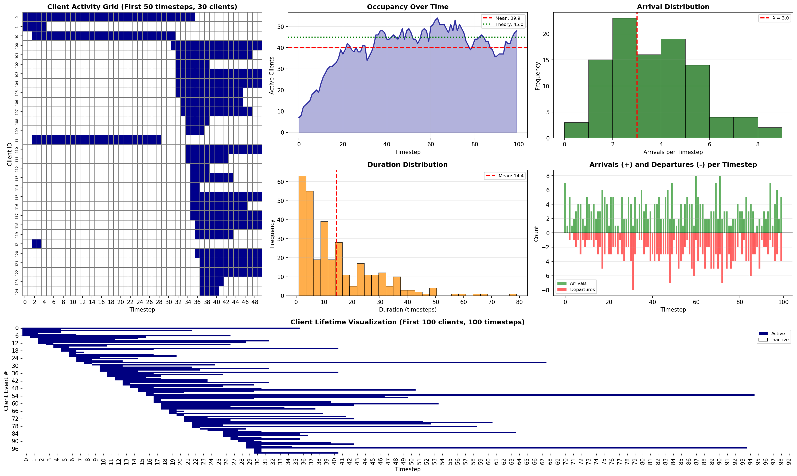

Í# Arrival/Departure Model - Functionality Report

## Model Configuration

| Parameter | Value | Description |
|-----------|-------|-------------|
| Arrival Rate (λ) | 3.0 | Average arrivals per timestep (Poisson) |
| Mean Duration (μ) | 15.0 | Average connection duration (Exponential) |
| Total Timesteps | 100 | Simulation horizon |
| Random Seed | 314 | For reproducibility |

## Simulation Results

### Overall Statistics

| Metric | Value |
|--------|-------|
| **Total Clients Generated** | 323 |
| **Mean Occupancy** | 39.91 clients/timestep |
| **Max Occupancy** | 54 clients |
| **Theoretical Occupancy (λ×μ)** | 45.00 clients |

### Duration Statistics

| Metric | Value (timesteps) |
|--------|-------------------|
| Mean | 14.38 |
| Std Dev | 13.23 |
| Min | 1 |
| Max | 79 |

## Model Behavior

### How It Works

The arrival/departure model simulates a **queueing system** where:

1. **Arrivals**: At each timestep `t`, the number of new clients is drawn from a Poisson distribution with rate λ = 3.0
2. **Duration**: Each arriving client's connection duration is drawn from an Exponential distribution with mean μ = 15.0
3. **Departures**: Client `i` departs at timestep `t_arrival + duration`

### Mathematical Foundation

**Poisson Process (Arrivals)**:
```
P(N(t) = k) = (λ^k × e^(-λ)) / k!
```

**Exponential Distribution (Duration)**:
```
f(d) = (1/μ) × e^(-d/μ)
```

**Little's Law (Expected Occupancy)**:
```
L = λ × W = 3.0 × 15.0 = 45.00 clients
```

## Visualizations



### Visualization Descriptions

1. **Client Activity Grid**: Shows which clients are active (blue) vs inactive (white) over the first 50 timesteps
   - Each row is a client
   - Each column is a timestep
   - Blue cells indicate the client is connected

2. **Occupancy Over Time**: Line plot showing total number of active clients at each timestep
   - **Blue line**: Actual occupancy
   - **Red dashed**: Observed mean occupancy
   - **Green dotted**: Theoretical expected occupancy (λ×μ)

3. **Arrival Distribution**: Histogram showing how many clients arrive at each timestep
   - **Red line**: Expected arrival rate (λ)
   - Demonstrates Poisson distribution

4. **Duration Distribution**: Histogram of connection durations
   - **Red line**: Mean duration
   - Shows exponential distribution shape

5. **Arrivals and Departures**: Bar chart showing:
   - **Green bars (positive)**: New arrivals
   - **Red bars (negative)**: Departures

6. **Client Lifetime Heatmap**: Gantt-style visualization showing when each client is active
   - Each row is one client instance
   - Shows the duration and timing of each connection

## Key Insights

### Observed vs Theoretical

- **Theoretical Mean Occupancy**: 45.00 clients
- **Observed Mean Occupancy**:39.91 clients
- **Difference**: 5.09 clients (11.3%)

The difference is due to:
1. Finite simulation horizon (transient effects)
2. Random variation
3. Edge effects at start and end of simulation

### Distribution Characteristics

- **Arrival Variability**: Poisson distribution creates natural burstiness in arrivals
- **Duration Spread**: Exponential distribution produces high variability (std = 13.23, mean = 14.38)
- **Dynamic Occupancy**: Number of active clients varies significantly over time (max: 54, mean: 39.91)

## Integration with Network Environment

This model is used in the WiFi network simulation to:

1. **Dynamically generate active clients** at each timestep
2. **Control client lifecycle** (when they connect/disconnect)
3. **Create realistic load patterns** instead of static client sets
4. **Enable temporal dynamics** in network behavior

Each simulated client is mapped to a real MAC address from the dataset, allowing us to use historical RSSI data while maintaining dynamic arrival/departure patterns.

---
Generated: 2026-01-26 18:23:17.859652
